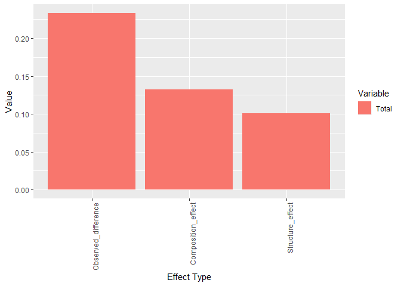
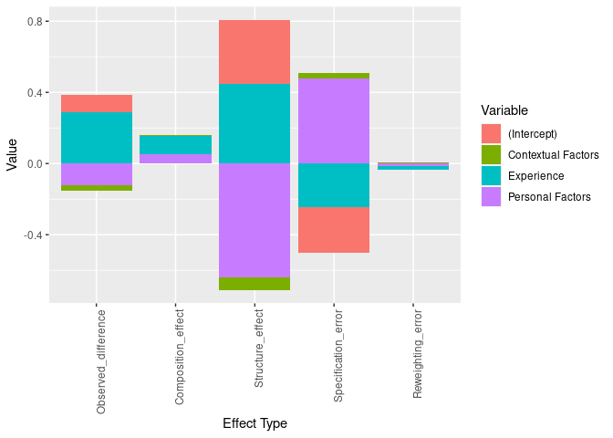
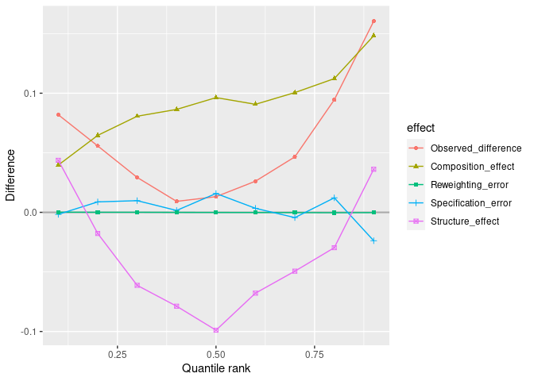
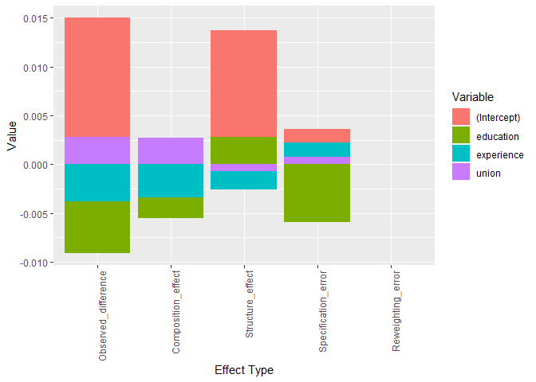

- <a href="#ddecompose-detailed-distributional-decompositions"
  id="toc-ddecompose-detailed-distributional-decompositions"><code>ddecompose</code>:
  Detailed Distributional Decompositions</a>
  - <a href="#overview" id="toc-overview">Overview</a>
  - <a href="#installation" id="toc-installation">Installation</a>
  - <a href="#background" id="toc-background">Background</a>
    - <a href="#oacaxa-blinder-decomposition"
      id="toc-oacaxa-blinder-decomposition">Oacaxa-Blinder Decomposition</a>
    - <a href="#reweighting-decomposition"
      id="toc-reweighting-decomposition">Reweighting Decomposition</a>
    - <a href="#sequential-decomposition"
      id="toc-sequential-decomposition">Sequential Decomposition</a>
    - <a href="#doubly-robust-oaxaca-blinder-decomposition"
      id="toc-doubly-robust-oaxaca-blinder-decomposition">‘Doubly Robust’
      Oaxaca-Blinder Decomposition</a>
    - <a href="#reweighted-rif-regression-decomposition"
      id="toc-reweighted-rif-regression-decomposition">Reweighted RIF
      Regression Decomposition</a>
    - <a href="#inference" id="toc-inference">Inference</a>
  - <a href="#examples" id="toc-examples">Examples</a>
    - <a href="#oaxaca-blinder-decomposition"
      id="toc-oaxaca-blinder-decomposition">Oaxaca-Blinder Decomposition</a>
    - <a href="#doubly-robust-decompostion"
      id="toc-doubly-robust-decompostion">‘Doubly Robust’ Decompostion</a>
    - <a href="#rif-regression-decomposition"
      id="toc-rif-regression-decomposition">RIF Regression Decomposition</a>
    - <a href="#reweighting-decomposition-1"
      id="toc-reweighting-decomposition-1">Reweighting Decomposition</a>
  - <a href="#replication-of-firpo-fortin-and-lemieux-2018"
    id="toc-replication-of-firpo-fortin-and-lemieux-2018">Replication of
    Firpo, Fortin, and Lemieux (2018)</a>
    - <a href="#loading-data" id="toc-loading-data">Loading Data</a>
    - <a href="#reweighted-rif-regression-decomposition-table-4"
      id="toc-reweighted-rif-regression-decomposition-table-4">Reweighted RIF
      Regression Decomposition (Table 4)</a>
    - <a href="#presentation-of-results"
      id="toc-presentation-of-results">Presentation of Results</a>
  - <a href="#credits" id="toc-credits">Credits</a>
  - <a href="#references" id="toc-references">References</a>

<!-- README.md is generated from README.Rmd. Please edit that file -->

# `ddecompose`: Detailed Distributional Decompositions

<!-- badges: start -->

[](https://github.com/samumei/ddecompose/actions/workflows/R-CMD-check.yaml)
[](https://app.codecov.io/gh/samumei/ddecompose?branch=master)
[](https://lifecycle.r-lib.org/articles/stages.html#stable)
[](https://CRAN.R-project.org/package=ddecompose)
[](https://choosealicense.com/licenses/gpl-3.0/)
<!-- badges: end -->

## Overview

The R package **ddecompose** implements the [Oaxaca
(1973)](https://www.jstor.org/stable/2525981)-[Blinder
(1973)](https://www.jstor.org/stable/144855) decomposition method and
generalizations of it that decompose differences in distributional
statistics beyond the mean.

`ob_decompose()` decomposes differences in the mean outcome between two
groups into one part explained by different covariates (composition
effect) and into another part due to differences in the way covariates
are linked to the outcome variable (structure effect). The function
further divides the two effects into the contribution of each covariate
and allows for weighted ‘doubly robust’ decompositions. For
distributional statistics beyond the mean, the function performs the RIF
decomposition proposed by [Firpo, Fortin, and Lemieux
(2018)](https://doi.org/10.3390/econometrics6020028).

`dfl_decompose()` divides differences in distributional statistics into
an composition effect and a structure effect using inverse probability
weighting as introduced by [DiNardo, Fortin, and Lemieux
(1996)](https://www.jstor.org/stable/2171954). The function also allows
to sequentially decompose the composition effect into the contribution
of single covariates.

The package contains generic summary, print and plot functions for the
results and computes standard errors. This documentation provides a
brief overview of the functions implemented in the package. For a more
detailed discussion of decomposition methods including their respective
assumptions and limitations, refer to [Fortin, Lemieux, and Firpo
(2011)](https://economics.ubc.ca/wp-content/uploads/sites/38/2013/05/pdf_paper_nicole-fortin-decomposition-methods.pdf)
and Firpo et al. (2018).

## Installation

You can hopefully soon install the CRAN version of `ddecompose`

``` r
install.packages("ddecompose")
```

Until now, refer to the latest development version from GitHub:

``` r
devtools::install_github("samumei/ddecompose")
```

## Background

### Oacaxa-Blinder Decomposition

The original decomposition method introduced by Oaxaca (1973) and
Blinder (1973) divides the difference in the mean of an outcome variable
(e.g., hourly wages) between two groups $g = 0, 1$ into a part explained
by differences in the mean of the covariates (e.g., educational level or
experience) and into another part due to different linear regression
coefficients (e.g., returns to education) that link the covariates to
the outcome variable.

The method linearly models the relationship between the outcome $Y$ and
covariates $X$
$$Y_{g,i} = \beta_{g,0} + \sum^K_{k=1}X_{k,i}\beta_{g,k} + \varepsilon_{g,i},$$
where $\beta_{g,0}$ is the intercept and $\beta_{g,k}$ are the slope
coefficients of covariates $k = 1,\ldots, K$. Moreover, it is assumed
that the error term $\varepsilon$ is conditionally independent of $X$,
i.e., $E( \varepsilon_{g,i} | X_{1,i}, \ldots ,X_{k,i}) = 0$, and that
there is an overlap in observable characteristics across groups (‘common
support’).

The coefficients are estimated with OLS. Together with the sample means
of the covariates, one can derive a counterfactual mean  
$$\overline Y_C = \widehat \beta_{0,0} + \sum^K_{k=1}\overline X_{1,k} \widehat \beta_{0,k}$$
that would be observed if group $1$ had the same coefficients like group
$0$. By adding and subtracting the counterfactual, the observed
difference
$$\widehat\Delta^\mu_O = (\overline Y_1 - \overline Y_C) + (\overline Y_C - \overline Y_0) = \widehat\Delta^\mu_S + \widehat\Delta^\mu_C, $$

is divided into the aggregate structure effect
$$\widehat\Delta^\mu_S  = (\widehat \beta_{1,0} - \widehat \beta_{0,0}) + \sum^K_{k=1}\overline X_{1,k}(\widehat \beta_{1,k} - \widehat \beta_{0,k}),$$

that captures outcome differences due to different coefficients, and the
composition effect
$$\widehat\Delta^\mu_X = \sum^K_{k=1} (\overline X_{1,k} - \overline X_{0,k})\widehat \beta_{0,k}, $$

which accounts for mean differences of the covariates. Note that we
could also combine the coefficients from group 1 with the covariates of
group 0 to define a counterfactual. Such a change in the “reference”
group generally leads to different results.

$\widehat\Delta^\mu_S$ and $\widehat\Delta^\mu_X$ denote the aggregate
composition terms. Since the method hinges on an additive linear model,
the terms can be further divided into the contribution of each covariate
$k$ in a *detailed decomposition*. For instance, the contribution of
covariate $k = 1$ to the structure effect is
$\overline X_{1,1}(\widehat \beta_{1,1} - \widehat \beta_{0,1})$, while
$(\overline X_{1,1} - \overline X_{0,1})\widehat \beta_{0,1}$ is the
covariate’s contribution to the composition effect.

### Reweighting Decomposition

The Oaxaca-Blinder decomposition is limited to the mean. Moreover, the
decomposition terms are biased if the expectation of the outcome
conditional on the covariates is not linear (see [Barsky et al.,
2002](https://www.jstor.org/stable/3085702)). DiNardo, Fortin, and
Lemieux (1996), DFL hereafter, propose an alternative approach that
overcomes both shortcomings. Instead of modeling the conditional mean,
the method uses inverse probability weighting to define a counterfactual
outcome distribution that combines the conditional outcome distribution
of one group and the covariates distribution of the other group. For
instance, if we are interested in the outcomes of group 0 with
covariates of group 1, we would reweight the outcome distribution of
group 0 such that its covariates distribution matches that of group 1
$$F_{Y_C}(y) = \int F_{Y_0}(y|x)dF_{X_1} (x)= \int F_{Y_0}(y|x)\Psi_X(x)dF_{X_0}(x).$$

By applying Bayes’ rule, the reweighting factor,
$$\Psi_X(x) = \frac{dF_{X_1}(x)}{dF_{X_0}(x)} = \frac{P(g=0)P(g=1|x)}{P(g=1)P(g=0|x)},$$

can be expressed in terms of $P(g)$ and $P(g|x)$, the (conditional)
probabilities of belonging to group $g$. This allows us to estimate the
reweighting factor using sample probabilities of each group and fitting
conditional probability models (e.g., logit) in the joint sample. The
estimated factors are then used to estimate weighted distributional
statistics of interest (e.g., mean, quantiles or Gini coefficient) in
the reference sample – group 0 in the present example. The resulting
counterfactual distributional statistic,
$\widehat\nu_C=\widehat\nu(F_{Y_C})$, is then contrasted with the
observed difference
$$\widehat\Delta_O^{\nu} = (\widehat\nu_1 - \widehat\nu_C) + (\widehat\nu_C - \widehat\nu_0) = \widehat\Delta_S^\nu + \widehat\Delta_X^\nu,$$

which yields again an aggregate structure effect and aggregate
composition effect.

The two decomposition terms account for the contribution of the
covariates and of the conditional outcome distribution, respectively,
assuming common support and ignorability. The latter condition asserts
that the distribution of unobserved covariates $\varepsilon$ conditional
on observed covariates $X$ is independent of group $g$.

### Sequential Decomposition

In contrast to the Oaxaca-Blinder decomposition, where the contributions
of each covariate simply add up, detailed decompositions are not
straightforward in the reweighting framework. However, DFL show that we
can sequentially alter the covariates distributions to decompose the
composition effect into the contribution of single covariates. For
instance, assume we want to distinguish the effect of covariate $X_1$
(e.g., union status) from that of covariate $X_2$ (e.g., industry). We
begin again with the counterfactual distribution based on the
conditional outcome distribution of group 0 and the covariates
distribution of group 1
$$F_{Y_{C}}(y) = \iint F_{Y_0}(y|x_1,x_2)dF_{X_{1,1}}(x_1|x_2)dF_{X_{1,2}}(x_2)$$

and introduce a second counterfactual where we combine the conditional
outcome distribution of group 0 as well as the conditional covariate
distribution of $X_1$ given $X_2$ (e.g., union coverage by industry) of
group 0 with the covariates distribution $X_2$ (e.g., employment by
industry) of group 1
$$F_{Y_{C,X_2}}(y) = \iint F_{Y_0}(y|x_1,x_2)dF_{X_{0,1}}(x_1|x_2)dF_{X_{1,2}}(x_2) $$

which can be expressed as the outcome distribution 0
$$F_{Y_{C,X_2}}(y) = \iint F_{Y_0}(y|x_1,x_2)dF_{X_{0,1}}(x_1|x_2)\Psi_{X_2}(x_2)dF_{X_{0,2}}(x_2),$$
reweighted by the factor
$$\Psi_{X_2}(x_2) = \frac{dF_{X_{1,2}}(x_2)}{dF_{X_{0,2}}(x_2)} =  \frac{P(g=0)P(g=1|x_2)}{P(g=1)P(g=0|x_2)}.$$

With the distributional statistics of the additional counterfactual, we
can divide the aggregate decomposition effect into the contribution of
each covariate
$$\widehat \Delta_X^{\nu} =  (\widehat \nu_C - \widehat \nu_{C,X_2}) + (\widehat \nu_{C,X_2} - \widehat \nu_0) = \widehat \Delta_{X_1}^\nu + \widehat \Delta_{X_2}^\nu.$$

Sequential decompositions are path dependent because the detailed
composition effects attributed to single covariates depend on the order
of which we include the variables into the sequence. For instance, it
matters if we reweight union coverage by industry $F(x_1|x_2)$ or the
industry employment given union coverage $F(x_2|x_1)$.

Moreover, we get different results if we do not combine the marginal
covariate distribution $X_2$ (e.g., industry employment) of group 1 with
the conditional distribution of $X_1$ given $X_2$ (e.g., union density
by industry) of group 0 but rather combine the marginal of group 0 with
the conditional distribution of group 1 to derive the counterfactual,
e.g.,
$$F_{Y_{C,X_1}}(y) = \iint F_{Y_0}(y|x_1,x_2)dF_{X_{1,1}}(x_1|x_2)dF_{X_0,2}(x_2).$$
where we would reweight group 0 with a slightly different factor
$$\Psi_{X_1}(x_1,x_2) = \frac{dF_{X_{1,1}}(x_1|x_2)}{dF_{X_{0,1}}(x_1|x_2)} =  \frac{P(g=0|x_2)P(g=1|x_1,x_2)}{P(g=1|x_2)P(g=0|x_1,x_2)}.$$

### ‘Doubly Robust’ Oaxaca-Blinder Decomposition

A robust and path independent alternative for detailed decompositions at
the mean is to combine DFL reweighting with the linear Oaxaca-Blinder
method (see Fortin et al., 2011: 48-51). This approach has the valuable
side effect of accounting for potential errors introduced by an
incomplete inverse probability weighting and the linear model
specification, respectively.

The estimation proceeds in two steps. First, the reweighting function
$\widehat\Psi_X(x)$, which matches the characteristics of group $0$ (if
group 0 is the reference group) to those of group $1$, is derived.
Second, the linear model and the covariate means are estimated in the
two observed samples as well as in the reweighted sample $0$, yielding
$\widehat \beta_{C,0}$, $\widehat \beta_{C,k}$, and $\overline X_{C,k}$.

The mean of the reweighted sample builds the main counterfactual to
derive the aggregate structure and composition effects, respectively.
The detailed decomposition terms are also evaluated with respect to the
statistics of the reweighted sample, i.e.,

$$\widehat\Delta^\mu_{O,R} = (\widehat \beta_{1,0} - \widehat \beta_{C,0}) + \sum^K_{k=1} (\overline X_{1,k}\widehat \beta_{1,k} - \overline X_{C,k}\widehat \beta_{C,k}) + \sum^K_{k=1} (\overline X_{C,k}\beta_{C,k} - \overline X_{0,k}\widehat \beta_{0,k}) = \widehat\Delta^\mu_{S,R}  + \widehat\Delta^\mu_{X,R}.$$
These decomposition terms can be further decomposed into a structure and
into a composition effect, respectively. This separates the errors from
reweighting $\widehat\Delta^\mu_{S,e}$ and the linear specification
$\widehat\Delta^\mu_{X,e}$, respectively, and yields a “pure”
composition effect $\widehat\Delta^\mu_{X,p}$ and a “pure” structure
effect $\widehat\Delta^\mu_{S,p}$ for each covariate.

Specifically, the structure effect can be written as

$$\widehat\Delta^\mu_{S,R} = (\widehat \beta_{1,0} - \widehat \beta_{C,0}) + \sum^K_{k=1}\overline X_{1,k}(\widehat \beta_{1,k} - \widehat \beta_{C,k}) + \sum^K_{k=1} (\overline X_{1,k} - \overline X_{C,k})\widehat \beta_{C,k} = \widehat\Delta^\mu_{S,p} + \widehat\Delta^\mu_{S,e}.$$

By comparing $\beta_{1,k}$ to the coefficients of the reweighted group
$0$, $\widehat \beta_{C,k}$, the true underlying structure effect can be
identified. Moreover, the reweighting error, $\widehat\Delta^\mu_{S,e}$,
indicates how accurately the reweighting function $\widehat\Psi(X_i)$
reweights the covariates distribution of group $0$ to that of group $1$.
Thus, identifying the reweighting error allows to measure the “pure”
structure effect, $\widehat\Delta^\mu_{S,p}$. If the composition of
group $1$ is equal to the reweighted group $0$, the reweighting error is
zero.

Similarly, the additional decomposition of the composition effect reads
as

$$\widehat\Delta^\mu_{X,R} = \sum^K_{k=1} (\overline X_{C,k} - \overline X_{0,k})\widehat \beta_{0,k} + (\widehat \beta_{C,0} - \widehat \beta_{0,0}) + \sum^K_{k=1}\overline X_{C,k}(\widehat \beta_{C,k} - \widehat \beta_{0,k}) = \widehat\Delta^\mu_{X,p} + \widehat\Delta^\mu_{X,e}.$$

The specification error, $\widehat\Delta^\mu_{X,e}$, measures the extent
to which the estimated coefficients change due to a different
distribution of covariates if the (wage) structure remains the same.
Thereby, the “pure” effect, $\overline X_{C,k} - \overline X_{0,k}$, for
each covariate can be estimated, summing to the aggregate pure structure
effect, $\widehat\Delta^\mu_{X,p}$. If the model is truly linear, i.e.,
correctly specified, $\beta_C$ of the reweighted group $0$ will be
identical to $\beta_0$ and the specification error will be zero (Fortin
et al. 2011, p. 49-50).

The reweighted OB decomposition is “doubly robust” as it yields
consistent estimates even if either the linear model or the reweighting
estimator is misspecified. In contrast to the simple reweighting or
linear approach it does not hinge on a single correctly specified model.
While the reweighted OB decomposition is doubly robust and path
independent, it is limited to the mean.

### Reweighted RIF Regression Decomposition

A path independent method that goes beyond the mean is the RIF
decomposition of Firpo, Fortin, and Lemieux (2018). The approach
approximates the expected value of the ‘recentered influence function’
(RIF) of the distributional statistic (e.g., quantile, variance, or Gini
coefficient) of an outcome variable conditional on covariates with
linear regressions. RIF regression coefficients can be consistent
estimates of the marginal effect of a small change in the expected value
of a covariate to the distributional statistics of an outcome variable
(see [Firpo et al.,
2009a](https://www.econometricsociety.org/publications/econometrica/2009/05/01/unconditional-quantile-regressions)
and the documentation of the companion package
[`rifreg`](https://github.com/samumei/rifreg)). Thus, they can be used
to decompose between-group difference in distributional statistics.
Firpo et al. (2018) combine the RIF regressions again with the
reweighting estimator to avoid specification errors.

First, the approach computes the recentered influence function (RIF) of
the outcome variable $Y$ and a distributional statistic of interest
$\nu$. Then, an OLS regression of the transformed outcome variable $Y$
is run on the explanatory variables $X$. Thereafter, the decomposition
method is analogous to the original OB method:

$$\widehat\Delta^\nu_{O,R} =  \widehat\Delta^\nu_{S,p} + \widehat\Delta^\nu_{S,e} + \widehat\Delta^\nu_{X,p} +  \widehat\Delta^\nu_{X,e}.$$
With $\widehat\Delta^\nu_{S,p}$ and $\widehat\Delta^\nu_{S,e}$
estimating the pure structure effect and the reweighting error as

$$\widehat\Delta^\nu_{S,R} =  \widehat\Delta^\nu_{S,p} + \widehat\Delta^\nu_{S,e} = (\widehat \beta_{1,0} - \widehat \beta_{C,0}) + \sum^K_{k=1}\overline X_{1,k}(\widehat \beta_{1,k} - \widehat \beta_{C,k}) + \sum^K_{k=1} (\overline X_{1,k} - \overline X_{C,k})\widehat \beta_{C,k}$$
and $\widehat\Delta^\nu_{X,p}$ and $\widehat\Delta^\nu_{X,e}$ estimating
the pure coefficient effect and the specification error:

$$\widehat\Delta^\nu_{X,R} = \widehat\Delta^\nu_{X,p} + \widehat\Delta^\nu_{X,e} = \sum^K_{k=1} (\overline X_{C,k} - \overline X_{0,k})\widehat \beta_{0,k} + (\widehat \beta_{C,0} - \widehat \beta_{0,0}) + \sum^K_{k=1}\overline X_{C,k}(\widehat \beta_{C,k} - \widehat \beta_{0,k})$$
with the RIF regression coefficients $\widehat \beta$ and the covariate
means $\overline X$ of groups $0$, $1$, and $C$, the reweighted
reference group 0, respectively.

Again, the specification error increases if the conditional expectation
of the RIF is not well approximated by the linear model. Moreover, as
the RIF regression coefficients capture the marginal effects of small
location shifts in the covariates distribution on the distributional
statistic of the outcome variable, the specification error can be large
if the location shifts are substantial or if the between-group
differences in the covariates distribution relate to higher moments or
the dependence structure (see also [Rothe, 2012:
16-19](https://docs.iza.org/dp6397.pdf) or [Rothe, 2015:
328](https://doi.org/10.1080/07350015.2014.948959)).

### Inference

Analytical standard errors are straightforward for the original OB
decomposition under the assumption of independence between the groups
(see Jann, [2005](https://boris.unibe.ch/69506/1/oaxaca_se_handout.pdf)
and
[2008](https://journals.sagepub.com/doi/abs/10.1177/1536867X0800800401)).
[Firpo
(2007)](https://onlinelibrary.wiley.com/doi/abs/10.1111/j.1468-0262.2007.00738.x)
and [Firpo and Pinto (2016)](https://www.jstor.org/stable/26609621)
develop asymptotic theory for the reweighting estimator. [Firpo, Fortin,
and Lemieux
(2009b)](https://www.econometricsociety.org/publications/econometrica/2009/05/01/unconditional-quantile-regressions/supp/6822_extensions_0.pdf)
and Firpo et al. (2018) do the same for the RIF estimator and for the
RIF decomposition terms, respectively. The authors propose to bootstrap
standard errors. `ddecompose` allows to bootstrap standard errors in
both `ob_decompose()` and `dfl_decompose()`. For the classical OB
decomposition, analytical standard errors are available, too.

## Examples

The following examples illustrate the workings of the main decomposition
functions in `ddecompose`. We use a sample of the National Longitudinal
Survey (NLSY) 79 containig wage data from the year 2000 of workers who
were aged 35 to 43 in that year. The data is from O’Neill and O’Neill
(2006) and is used as an illustration of the Oxaca-Blinder mean
decomposition in Fortin, Lemieux, and Firpo (2011). The data contains
2655 male and 2654 female observations, respectively.

``` r
library(ddecompose)
#> Lade nötiges Paket: ggplot2
#> Warning: Paket 'ggplot2' wurde unter R Version 4.3.2 erstellt
data("nlys00")
```

### Oaxaca-Blinder Decomposition

Let us decompose the gender wage gap into composition and structure
effect, using the standard Oaxaca-Blinder decompostion without
reweighting. First, we specify a wage structure model and then run the
estimation.

``` r

model <- log(wage) ~  age + region + education + 
                        years_worked_civilian + years_worked_military + 
                        part_time + family_responsibility + industry 

gender_gap_decomposition <- ob_decompose(formula = model,
                                        data = nlys00,
                                        group = female)
```

In the default settings, heteroscedasticity-consistent standard errors
are calculated and factor variables are not normalized. Group 0 is
defined as the reference group (the group with the lower factor level)
and is subtracted from group 1. Using `summary()`, we can display the
decompostion formula and the estimation results.

``` r
summary(gender_gap_decomposition)
#> 
#> 
#> Oaxaca-Blinder decomposition of mean difference
#> between female == 'no' (group 1) and female == 'yes' (group 0). 
#> The reference group is 'yes'. 
#> 
#> Group 0: female == 'yes' (2654 observations) 
#> Group 1: female == 'no' (2655 observations) 
#> 
#> Composition Effect: (X1 - X0) * b0 
#>   Structure Effect: X1 * (b1 - b0) 
#> 
#> Aggregate decomposition:
#> 
#>                      Estimate Std. Error    CI [Low     High]
#> Observed difference 0.2333003 0.01466550 0.20455644 0.2620441
#> Composition effect  0.1323814 0.01420535 0.10453942 0.1602234
#> Structure effect    0.1009189 0.01655736 0.06846707 0.1333707
#> 
#> 
#> Observed difference:
#> 
#>                          Estimate  Std. Error     CI [Low        High]
#> (Intercept)            0.09813187 0.213742888 -0.32079649  0.517060232
#> age                   -0.19459845 0.231908532 -0.64913082  0.259933920
#> region                 0.03970035 0.027067240 -0.01335047  0.092751163
#> education              0.05379461 0.033738154 -0.01233096  0.119920179
#> years_worked_civilian  0.27105219 0.061730110  0.15006340  0.392040980
#> years_worked_military  0.01683904 0.003284003  0.01040251  0.023275567
#> part_time             -0.01470307 0.008433550 -0.03123253  0.001826383
#> family_responsibility  0.03558673 0.011343387  0.01335410  0.057819361
#> industry              -0.07250298 0.031630225 -0.13449708 -0.010508877
#> 
#> 
#> Structure effect:
#> 
#>                            Estimate  Std. Error      CI [Low        High]
#> (Intercept)            0.0981318689 0.213742888 -0.320796494  0.517060232
#> age                   -0.2011988641 0.231292303 -0.654523448  0.252125720
#> region                 0.0352173874 0.026838967 -0.017386022  0.087820796
#> education              0.0667616317 0.032733435  0.002605277  0.130917986
#> years_worked_civilian  0.2155020831 0.063469186  0.091104764  0.339899403
#> years_worked_military -0.0085748963 0.008335066 -0.024911325  0.007761532
#> part_time             -0.0298335540 0.005684065 -0.040974117 -0.018692991
#> family_responsibility  0.0008774603 0.004232174 -0.007417448  0.009172369
#> industry              -0.0759642206 0.029614806 -0.134008173 -0.017920268
#> 
#> 
#> Composition effect:
#> 
#>                           Estimate  Std. Error       CI [Low        High]
#> (Intercept)            0.000000000 0.000000000  0.0000000000  0.000000000
#> age                    0.006600415 0.001918589  0.0028400506  0.010360779
#> region                 0.004482959 0.002448367 -0.0003157525  0.009281671
#> education             -0.012967020 0.005805598 -0.0243457828 -0.001588258
#> years_worked_civilian  0.055550105 0.005518193  0.0447346451  0.066365565
#> years_worked_military  0.025413935 0.007335229  0.0110371494  0.039790721
#> part_time              0.015130482 0.004237526  0.0068250830  0.023435882
#> family_responsibility  0.034709271 0.008300282  0.0184410164  0.050977526
#> industry               0.003461243 0.005102148 -0.0065387825  0.013461268
```

`ddecompose` comes with a convenient plot function. To plot the overall
composition and structure effect, we have to set
`detailed_effects = FALSE`.

``` r
plot(gender_gap_decomposition, detailed_effects = FALSE)
```



To change the reference group, we `reference_0` needs to be set to
`FALSE`. Note that this does not change the subtraction terms in the
decomposition, i.e., (X1 - X0) and (b1 - b0). To change the direction of
the subtraction, the parameter `subtract_1_from_0` needs to be set to
`TRUE`. This merely changes the sign of the decomposition results. We
can indicate the weights column of the `data` in the `weights` parameter
and normalize factor variables by setting `normalize_factors = TRUE`.

### ‘Doubly Robust’ Decompostion

To compute a more robust decomposition, we can add reweighting to the
decompostion. Thereby, we also estimate the specification and
reweighting error of the results. By default, the same function model is
used for reweighting as for the decompostion. However, it is advisable
to add a more flexible reweighting model, taking interactions into
account. The reweighting formula is added to the decomposition formula,
separated by a `|`. For this decompostion method, standard errors need
to be computed using bootstrap. By increasing the number of `cores` the
bootstrap replications are computed on, we can reduce computation time.
Per default, 100 bootstrap replications are calculated.

``` r

model_w_reweighting <- log(wage) ~  
                           age + region + education + 
                           years_worked_civilian + years_worked_military + 
                           part_time + family_responsibility + industry |
                           age + region + education + 
                           years_worked_civilian + years_worked_military + 
                           part_time + family_responsibility + industry +
                           education:region + age:education 


gender_gap_decomposition_w_reweighting <- 
    ob_decompose(formula = model_w_reweighting,
                 data = nlys00,
                 group = female, 
                 reweighting = TRUE, 
                 bootstrap = TRUE, 
                 cores = 4)
#> 
#> Bootstrapping standard errors...
```

The default method to fit and predict conditional probabilities, used to
derive the reweighting factor, is a logit model. However, one can also
use `reweighting_method = "fastglm"`, for a faster logit model
computation or `random forests` for a different reweighting method. If
`trimming` is set to `TRUE`, observations with dominant reweighting
factor values are trimmed. Per default, reweighting factor values are
trimmed according to rule of Huber, Lechner, and Wunsch (2013). Therby,
the `trimming_threshold`, i.e., the maximal accepted relative weight of
the reweighting factor value (inverse probability weight) of a single
observation, is set to `sqrt(N)/N`, where `N` is the number of
observations in the reference group. The trimming threshold can also be
set manually to a numeric value.

We can aggregate the detailed effects in the `summary()` and `plot()`
function. For instance, if we want to separate personal and contextual
factors that explain the wage gap, we can aggregate these variables in a
list.

``` r

custom_aggregation <- list(`Personal Factors` = c("age", 
                                                  "education<10 yrs", 
                                               "educationHS grad (diploma)",
                                               "educationHS grad (GED)",
                                               "educationSome college",
                                               "educationBA or equiv. degree",
                                               "educationMA or equiv. degree",
                                               "educationPh.D or prof. degree",
                                               "part_time",
                                               "family_responsibility"), 
                           `Experience` = c("years_worked_civilian",
                                            "years_worked_military"), 
                           `Contextual Factors` = c("regionNorth-central",
                                                 "regionSouth",
                                                 "regionWest",
                                                 "industryManufacturing",
                                                 "industryEducation, Health, Public Admin.",
                                                 "industryOther services"))

plot(gender_gap_decomposition_w_reweighting, 
     custom_aggregation = custom_aggregation)
```



If we add reweighting, the `plot()` and `summary()` function also
display the Specification and Reweighting Error. To reduce the
reweighting error, a more flexible reweighting model is advisable.

### RIF Regression Decomposition

To decompose group differences beyond the mean with `ob_deco` we are
using RIF regressions. In the following examples, we will analyze the
changes in wage inequality between 1983/85 and 2003/05 and assess what
covariates contribute to explaining these changes. First, we look at
changes in the variance. Then, we decompose the wage gap at each decile.
The data used is a sample of the the Merged Outgoing Rotation Group of
the Current Population Survey from 1983 to 1985 and 2003 to 2005,
respectively, used as example by Fortin, Lemieux & Firpo (2011).

``` r

data("men8305")

model_rifreg <- log(wage) ~ union*(education + experience) + education*experience 

# Variance
variance_decomposition <- ob_decompose(formula = model_rifreg,
                 data = men8305,
                 group = year, 
                 reweighting = TRUE, 
                 rifreg_statistic = "variance",
                 bootstrap = TRUE, 
                 cores = 4)
#> 
#> 
#> The same model specification is used for decomposition and to compute reweighting factors.
#> Bootstrapping standard errors...

print(variance_decomposition)
#> 
#> 
#> Reweighted RIF regression decomposition of difference in variance
#> between year == '2003-2005' (group 1) and year == '1983-1985' (group 0). 
#> The reference group is '1983-1985'. 
#> 
#> Aggregate decomposition:
#> 
#>                                        Observed difference Composition effect
#> Total difference                                0.05080427         0.02964428
#>                                        Structure effect Specification error
#> Total difference                             0.02889585        -0.007634391
#>                                        Reweighting error
#> Total difference                           -0.0001014668
#> 
#> Detailed decomposition:
#> 
#>                                        Observed difference Composition effect
#> (Intercept)                                  -2.953514e-02       0.000000e+00
#> unionyes                                      3.854936e-03       6.747955e-03
#> educationElementary                           1.217576e-03      -2.261465e-03
#> educationHS dropout                           5.593234e-03       7.932019e-04
#> educationSome College                        -4.570377e-04       2.401118e-03
#> educationCollege                              3.350059e-02       1.586419e-02
#> educationPost-graduate                        2.758235e-02       9.425738e-04
#> experience0-4                                 3.009142e-03      -8.153936e-03
#> experience5-9                                 1.207186e-02       1.589042e-03
#> experience10-14                               5.782613e-03       1.517266e-03
#> experience15-19                               5.042642e-03      -3.581431e-04
#> experience25-29                              -4.443290e-03       6.398896e-04
#> experience30-34                              -6.237351e-05       2.038179e-04
#> experience35-39                               1.067437e-03       1.265590e-04
#> experience>=40                                9.022699e-05      -4.981414e-04
#> unionyes:educationElementary                  1.694391e-03       1.794106e-03
#> unionyes:educationHS dropout                  4.255012e-04       6.240922e-04
#> unionyes:educationSome College                8.031642e-04       1.819326e-05
#> unionyes:educationCollege                    -6.126676e-04      -1.489616e-04
#> unionyes:educationPost-graduate              -8.443292e-04       6.297239e-04
#> unionyes:experience0-4                        1.517274e-03       1.130457e-03
#> unionyes:experience5-9                       -4.569321e-05       3.712171e-05
#> unionyes:experience10-14                     -6.161616e-04      -4.233076e-04
#> unionyes:experience15-19                     -8.785340e-04      -4.280223e-04
#> unionyes:experience25-29                      1.773275e-03       6.931553e-06
#> unionyes:experience30-34                     -3.778427e-04      -1.597100e-05
#> unionyes:experience35-39                     -5.250224e-04      -3.660962e-05
#> unionyes:experience>=40                      -1.310760e-04       1.796820e-04
#> educationElementary:experience0-4            -4.057103e-04      -2.470174e-04
#> educationHS dropout:experience0-4            -4.923516e-03      -2.954224e-03
#> educationSome College:experience0-4           1.179443e-03       1.605356e-04
#> educationCollege:experience0-4               -3.030659e-03       8.156006e-04
#> educationPost-graduate:experience0-4          1.132169e-03       2.402666e-03
#> educationElementary:experience5-9            -3.899965e-04      -1.978895e-04
#> educationHS dropout:experience5-9            -9.884150e-04      -9.319604e-04
#> educationSome College:experience5-9          -7.801482e-04       1.154293e-04
#> educationCollege:experience5-9               -2.997394e-03       3.708840e-04
#> educationPost-graduate:experience5-9         -1.450203e-04       1.352934e-03
#> educationElementary:experience10-14           2.578581e-04       1.321268e-06
#> educationHS dropout:experience10-14          -7.950854e-04      -6.999092e-04
#> educationSome College:experience10-14        -7.487258e-04       4.622051e-05
#> educationCollege:experience10-14             -6.066500e-04      -4.538782e-04
#> educationPost-graduate:experience10-14       -4.459226e-04       5.425117e-04
#> educationElementary:experience15-19          -5.040542e-05       2.947336e-05
#> educationHS dropout:experience15-19           3.312930e-05      -8.101928e-05
#> educationSome College:experience15-19         1.226768e-04       3.530076e-05
#> educationCollege:experience15-19             -1.468186e-03      -4.028135e-04
#> educationPost-graduate:experience15-19       -4.188611e-04       9.944657e-06
#> educationElementary:experience25-29          -5.729025e-05       4.004872e-05
#> educationHS dropout:experience25-29           1.197019e-04      -4.638974e-05
#> educationSome College:experience25-29         1.255377e-03       1.165385e-03
#> educationCollege:experience25-29             -2.198220e-04       2.368751e-04
#> educationPost-graduate:experience25-29       -1.345468e-03       4.610208e-04
#> educationElementary:experience30-34          -1.970255e-04      -7.781850e-05
#> educationHS dropout:experience30-34           1.935808e-04       6.350104e-05
#> educationSome College:experience30-34         1.170126e-03       1.386747e-03
#> educationCollege:experience30-34             -3.283644e-04       6.687601e-04
#> educationPost-graduate:experience30-34       -1.924387e-04      -1.199894e-04
#> educationElementary:experience35-39           4.144045e-04       3.712583e-04
#> educationHS dropout:experience35-39           7.394115e-05       5.080964e-05
#> educationSome College:experience35-39        -5.291030e-05       1.180895e-03
#> educationCollege:experience35-39             -1.165234e-03       2.003564e-04
#> educationPost-graduate:experience35-39       -4.131070e-04       2.983770e-04
#> educationElementary:experience>=40            4.053699e-04       5.075334e-04
#> educationHS dropout:experience>=40            1.418157e-04       2.148788e-04
#> educationSome College:experience>=40          1.536351e-04       7.782231e-05
#> educationCollege:experience>=40               1.073469e-04      -8.303411e-05
#> educationPost-graduate:experience>=40        -2.869877e-04       2.117686e-04
#>                                        Structure effect Specification error
#> (Intercept)                               -1.938704e-02       -1.014811e-02
#> unionyes                                   3.623530e-03       -6.455984e-03
#> educationElementary                       -5.838975e-05        3.536843e-03
#> educationHS dropout                       -9.692402e-04        5.766551e-03
#> educationSome College                      1.931313e-03       -4.786141e-03
#> educationCollege                           2.937953e-02       -1.174921e-02
#> educationPost-graduate                     3.490020e-02       -8.273478e-03
#> experience0-4                             -4.410422e-03        1.559807e-02
#> experience5-9                              2.888303e-03        7.594746e-03
#> experience10-14                           -6.476821e-04        4.913036e-03
#> experience15-19                            3.749807e-03        1.652751e-03
#> experience25-29                           -5.532299e-03        4.479942e-04
#> experience30-34                            8.465967e-05       -3.507468e-04
#> experience35-39                            2.985976e-04        6.418174e-04
#> experience>=40                            -3.792426e-04        9.674027e-04
#> unionyes:educationElementary              -1.400367e-05       -8.683947e-05
#> unionyes:educationHS dropout              -1.193165e-04       -7.924239e-05
#> unionyes:educationSome College             7.651545e-04        1.646577e-05
#> unionyes:educationCollege                 -4.933282e-04        4.393029e-05
#> unionyes:educationPost-graduate           -2.018270e-03        5.176858e-04
#> unionyes:experience0-4                     2.977906e-04        6.149385e-05
#> unionyes:experience5-9                    -3.648396e-04        2.829003e-04
#> unionyes:experience10-14                  -4.177046e-04        2.244961e-04
#> unionyes:experience15-19                  -5.057893e-04        5.789953e-05
#> unionyes:experience25-29                   1.421240e-03        3.509220e-04
#> unionyes:experience30-34                  -4.172809e-04        5.802214e-05
#> unionyes:experience35-39                  -2.627665e-04       -2.255001e-04
#> unionyes:experience>=40                   -6.077169e-05       -2.534568e-04
#> educationElementary:experience0-4         -1.243198e-04       -3.084105e-05
#> educationHS dropout:experience0-4         -1.138082e-03       -7.771150e-04
#> educationSome College:experience0-4        7.370303e-04        2.896053e-04
#> educationCollege:experience0-4            -3.265487e-03       -5.676782e-04
#> educationPost-graduate:experience0-4      -1.133870e-03       -1.498460e-04
#> educationElementary:experience5-9         -1.492510e-04       -3.696670e-05
#> educationHS dropout:experience5-9          2.456733e-04       -2.917854e-04
#> educationSome College:experience5-9       -4.261034e-04       -4.671383e-04
#> educationCollege:experience5-9            -2.767982e-03       -6.005058e-04
#> educationPost-graduate:experience5-9      -1.238182e-03       -2.607268e-04
#> educationElementary:experience10-14        3.377883e-04       -7.983092e-05
#> educationHS dropout:experience10-14        5.292451e-05       -1.486927e-04
#> educationSome College:experience10-14     -1.959245e-04       -5.938577e-04
#> educationCollege:experience10-14           2.757611e-04       -4.434181e-04
#> educationPost-graduate:experience10-14    -7.859789e-04       -1.955469e-04
#> educationElementary:experience15-19        1.081979e-05       -9.336303e-05
#> educationHS dropout:experience15-19        2.793405e-04       -1.676916e-04
#> educationSome College:experience15-19      3.665045e-04       -2.803778e-04
#> educationCollege:experience15-19          -1.082279e-03        2.719187e-05
#> educationPost-graduate:experience15-19    -4.422900e-04        1.236084e-05
#> educationElementary:experience25-29        5.885703e-05       -1.559371e-04
#> educationHS dropout:experience25-29        4.183363e-04       -2.523356e-04
#> educationSome College:experience25-29      7.384548e-04       -6.409787e-04
#> educationCollege:experience25-29          -1.265133e-04       -3.301076e-04
#> educationPost-graduate:experience25-29    -1.701284e-03       -1.123883e-04
#> educationElementary:experience30-34       -1.062503e-04       -1.406015e-05
#> educationHS dropout:experience30-34        4.218557e-04       -2.891788e-04
#> educationSome College:experience30-34      1.177977e-04       -3.374663e-04
#> educationCollege:experience30-34          -1.046761e-03        5.107965e-05
#> educationPost-graduate:experience30-34    -2.304361e-04        1.580504e-04
#> educationElementary:experience35-39        1.559394e-04       -1.147628e-04
#> educationHS dropout:experience35-39        2.656246e-04       -2.410842e-04
#> educationSome College:experience35-39     -9.948487e-04       -2.370733e-04
#> educationCollege:experience35-39          -1.120767e-03       -2.448789e-04
#> educationPost-graduate:experience35-39    -6.991931e-04       -1.656955e-05
#> educationElementary:experience>=40         6.820760e-05       -1.714928e-04
#> educationHS dropout:experience>=40         1.233282e-04       -1.929062e-04
#> educationSome College:experience>=40       5.015806e-05        2.460383e-05
#> educationCollege:experience>=40            2.332806e-04       -4.318656e-05
#> educationPost-graduate:experience>=40     -5.677803e-04        5.818506e-05
#>                                        Reweighting error
#> (Intercept)                                 0.000000e+00
#> unionyes                                   -6.056553e-05
#> educationElementary                         5.871029e-07
#> educationHS dropout                         2.721631e-06
#> educationSome College                      -3.327659e-06
#> educationCollege                            6.074214e-06
#> educationPost-graduate                      1.304902e-05
#> experience0-4                              -2.456814e-05
#> experience5-9                              -2.329079e-07
#> experience10-14                            -6.480811e-09
#> experience15-19                            -1.772616e-06
#> experience25-29                             1.124701e-06
#> experience30-34                            -1.042782e-07
#> experience35-39                             4.634668e-07
#> experience>=40                              2.082774e-07
#> unionyes:educationElementary                1.127692e-06
#> unionyes:educationHS dropout               -3.216811e-08
#> unionyes:educationSome College              3.350627e-06
#> unionyes:educationCollege                  -1.430809e-05
#> unionyes:educationPost-graduate             2.653160e-05
#> unionyes:experience0-4                      2.753200e-05
#> unionyes:experience5-9                     -8.756395e-07
#> unionyes:experience10-14                    3.543833e-07
#> unionyes:experience15-19                   -2.621878e-06
#> unionyes:experience25-29                   -5.818203e-06
#> unionyes:experience30-34                   -2.613002e-06
#> unionyes:experience35-39                   -1.461855e-07
#> unionyes:experience>=40                     3.470589e-06
#> educationElementary:experience0-4          -3.532031e-06
#> educationHS dropout:experience0-4          -5.409429e-05
#> educationSome College:experience0-4        -7.727817e-06
#> educationCollege:experience0-4             -1.309461e-05
#> educationPost-graduate:experience0-4        1.321874e-05
#> educationElementary:experience5-9          -5.889298e-06
#> educationHS dropout:experience5-9          -1.034252e-05
#> educationSome College:experience5-9        -2.335855e-06
#> educationCollege:experience5-9              2.100383e-07
#> educationPost-graduate:experience5-9        9.547817e-07
#> educationElementary:experience10-14        -1.420585e-06
#> educationHS dropout:experience10-14         5.920206e-07
#> educationSome College:experience10-14      -5.164018e-06
#> educationCollege:experience10-14            1.488524e-05
#> educationPost-graduate:experience10-14     -6.908414e-06
#> educationElementary:experience15-19         2.664463e-06
#> educationHS dropout:experience15-19         2.499648e-06
#> educationSome College:experience15-19       1.249320e-06
#> educationCollege:experience15-19           -1.028568e-05
#> educationPost-graduate:experience15-19      1.123363e-06
#> educationElementary:experience25-29        -2.589379e-07
#> educationHS dropout:experience25-29         9.097594e-08
#> educationSome College:experience25-29      -7.484176e-06
#> educationCollege:experience25-29           -7.620230e-08
#> educationPost-graduate:experience25-29      7.183755e-06
#> educationElementary:experience30-34         1.103460e-06
#> educationHS dropout:experience30-34        -2.597073e-06
#> educationSome College:experience30-34       3.047714e-06
#> educationCollege:experience30-34           -1.442993e-06
#> educationPost-graduate:experience30-34     -6.362912e-08
#> educationElementary:experience35-39         1.969587e-06
#> educationHS dropout:experience35-39        -1.408923e-06
#> educationSome College:experience35-39      -1.883695e-06
#> educationCollege:experience35-39            5.622863e-08
#> educationPost-graduate:experience35-39      4.278731e-06
#> educationElementary:experience>=40          1.121645e-06
#> educationHS dropout:experience>=40         -3.485234e-06
#> educationSome College:experience>=40        1.050901e-06
#> educationCollege:experience>=40             2.869913e-07
#> educationPost-graduate:experience>=40       1.083904e-05


# Deciles
deciles_decomposition <- ob_decompose(formula = model_rifreg,
                 data = men8305,
                 group = year, 
                 reweighting = TRUE, 
                 rifreg_statistic = "quantiles",
                 rifreg_probs = c(1:9)/10,
                 bootstrap = TRUE, 
                 cores = 4)
#> 
#> 
#> The same model specification is used for decomposition and to compute reweighting factors.
#> Warning in density.default(x = dep_var, weights = weights/sum(weights, na.rm =
#> TRUE), : Selecting bandwidth *not* using 'weights'

#> Warning in density.default(x = dep_var, weights = weights/sum(weights, na.rm =
#> TRUE), : Selecting bandwidth *not* using 'weights'

#> Warning in density.default(x = dep_var, weights = weights/sum(weights, na.rm =
#> TRUE), : Selecting bandwidth *not* using 'weights'

#> Warning in density.default(x = dep_var, weights = weights/sum(weights, na.rm =
#> TRUE), : Selecting bandwidth *not* using 'weights'

#> Warning in density.default(x = dep_var, weights = weights/sum(weights, na.rm =
#> TRUE), : Selecting bandwidth *not* using 'weights'

#> Warning in density.default(x = dep_var, weights = weights/sum(weights, na.rm =
#> TRUE), : Selecting bandwidth *not* using 'weights'

#> Warning in density.default(x = dep_var, weights = weights/sum(weights, na.rm =
#> TRUE), : Selecting bandwidth *not* using 'weights'

#> Warning in density.default(x = dep_var, weights = weights/sum(weights, na.rm =
#> TRUE), : Selecting bandwidth *not* using 'weights'

#> Warning in density.default(x = dep_var, weights = weights/sum(weights, na.rm =
#> TRUE), : Selecting bandwidth *not* using 'weights'
#> 
#> Bootstrapping standard errors...

plot(deciles_decomposition)
```



The RIF functions for the following functions are currently implemented:
`"quantiles"`, `"mean"`, `"variance"`, `"gini"`,
`"interquantile_range"`, and `"interquantile_ratio"`. However,
`ob_decompose` also allows to pass a custom RIF function for the
decomposition, by setting `rifreg_statistic = "custom"` and passing the
custom function to `custom_rif_function`. [Cowell and Flachaire
(2007)](https://doi.org/10.1016/j.jeconom.2007.01.001), [Essama-Nssah &
Lambert (2012)](https://doi.org/10.1108/S1049-2585(2012)0000020009), and
[Rios-Avila (2020)](https://doi.org/10.1177/1536867X20909690) derive the
influence functions for an array of distributional statistics. More
information about RIF regressions can be found in the documentation of
the companion package [`rifreg`](https://github.com/samumei/rifreg).

Custom RIF functions must specify a `dep_var` parameter for the outcome
variable $Y$, a `weights` for potential sample weights, and `probs`. If
they are not needed, they must be set to `NULL` in the function
definition (e.g. `probs = NULL`).

The following example shows how to write the RIF for the top 10 percent
income share and, then, to estimate the RIF regression decomposition
using this custom function. The formula for this specific RIF can be
found in Essam-Nssah & Lambert (2012) or Rios-Avila (2020).

``` r

# custom RIF function for top 10% percent income share
custom_top_inc_share <- function(dep_var,
                                 weights,
                                 probs = NULL,
                                 top_share = 0.1) {
  top_share <- 1 - top_share
  weighted_mean <- weighted.mean(
    x = dep_var,
    w = weights
  )
  weighted_quantile <- Hmisc::wtd.quantile(
    x = dep_var,
    weights = weights,
    probs = top_share
  )
  lorenz_ordinate <- sum(dep_var[which(dep_var <= weighted_quantile)] *
    weights[which(dep_var <= weighted_quantile)]) /
    sum(dep_var * weights)
  if_lorenz_ordinate <- -(dep_var / weighted_mean) * lorenz_ordinate +
    ifelse(dep_var < weighted_quantile,
      dep_var - (1 - top_share) * weighted_quantile,
      top_share * weighted_quantile
    ) / weighted_mean
  rif_top_income_share <- (1 - lorenz_ordinate) - if_lorenz_ordinate
  rif <- data.frame(rif_top_income_share, weights)
  names(rif) <- c("rif_top_income_share", "weights")
  return(rif)
}

custom_decomposition <- ob_decompose(formula = model_rifreg,
                 data = men8305,
                 group = year, 
                 reweighting = TRUE, 
                 rifreg_statistic = "custom",
                 custom_rif_function = custom_top_inc_share,
                 bootstrap = TRUE, 
                 cores = 4)
#> 
#> 
#> The same model specification is used for decomposition and to compute reweighting factors.
#> Bootstrapping standard errors...

plot(custom_decomposition)
```



### Reweighting Decomposition

Now, we present the usage of the other main function: `dfl_decompose()`.
Fortin, Lemieux, and Firpo (FLF, 2011, p. 79-88) decompose the increase
in USmale wage inequality between the early 1980s and the early 2000s
using the CPS data. In this example, we replicate their results and
treat the observations from 1983 to 1985 as reference group that is
reweighted.

``` r
library(ddecompose)
data("men8305")

flf_model <- log(wage) ~ union*(education + experience) + education*experience
flf_male_inequality  <- dfl_decompose(flf_model, 
                                  data = men8305,
                                  weights = weights,
                                  group = year, 
                                  bootstrap = TRUE, 
                                  cores = 4)
```

We can summarize the results:

``` r
summary(flf_male_inequality)
```

Using `plot()`, we can illustrate the decomposition accross different
quantiles.

``` r
plot(flf_male_inequality)
```

## Replication of Firpo, Fortin, and Lemieux (2018)

To validate the functions and provide users with an additional example,
we replicate the reweighted RIF regression decomposition estimates in
Firpo et al. (2018, p. 30). In their empirical example, Firpo et
al. focus in changes in wage inequality in the US between 1988 and 2016.
Using a large sample of male log wages in 1988-1990 (268’494
observations) and in 2014-2016 (236’296 observation) based on the
Outgoing Rotation Group (ORG) supplement of the Current Population
Survey (CPS), they attribute changes in variance, gini, and
interquantile ranges between the two time periods to changes in
composition (e.g., union coverage, education, and experience) and
changes in wage structure.

This replication follows the Stata replication code, that the authors
published alongside the paper and that is available on their website.
(INSERT LINK). The highest wages in the public CPS data set are
unavailable due to privacy concerns. The Firpo et al. impute these wages
using a random uniform Pareto distribution (CHECK WORDING). Since random
numbers are generated differently in R and Stata, even with an
equivalent seed. Therefore, we perform the entire data preparation in
Stata up until the estimation of the decomposition, i.e., the “oaxaca”
commands in Stata. This ensures that changes in the estimation results
between our function and the orignal paper do not stem from different
input data.

To reproduce the code below, make sure you download the entire data set
and Stata code from the journal’s website, execute the code up to the
oaxaca command, save the data and load it into your R environment.

### Loading Data

``` r
# Make sure you execute the Stata Code until the oaxaca commands 
# and save the data in the appropriate folder.
men8816_t4 <- readstata13::read.dta13("data-raw/usmen8816_t4.dta")

# Removing redundant observations - we replicate the reweighting within the function
men8816_t4 <- men8816_t4[men8816_t4$time <= 1,] 
```

### Reweighted RIF Regression Decomposition (Table 4)

The model is specified as in the Stata files, containing weights,
computing bootstrapped standard errors with 100 iterations, and setting
a fixed bandwidth of 0.06 for the epanechnikov kernel density
estimation.

``` r

set.seed(987421)

ffl_model_with_reweighting <- as.formula(
    paste("lwage2 ~ covered + nonwhite + nmarr + 
          ed0 + ed1 + ed3 + ed4 + ed5 + ",
          paste(grep(paste0("^ex(", paste(c(1:4, 6:9), collapse = "|"), ")$"), 
                     names(men8816_t4), value = T), collapse = " + "), " + ",
          paste(grep(paste0("^occd(", paste(c(11:60, 80:91), collapse = "|"), ")$"),
                     names(men8816_t4), value = T), collapse = " + "), " + ",                     
          paste(grep(paste0("^indd(", paste(c(1, 3:14), collapse = "|"), ")$"), 
                     names(men8816_t4), value = T), collapse = " + "), " + pub | ",
          paste("covered + nonwhite +",
                paste(grep("^marr", names(men8816_t4), value = TRUE), collapse = " + "), "+",
                paste(c("ed0", "ed1", "ed3", "ed4", "ed5"), collapse = " + "), "+",
                paste(grep("^ex[1-4]|^ex[6-9]", names(men8816_t4), value = TRUE), collapse = " + "), "+",
                paste(grep("^uned", names(men8816_t4), value = TRUE), collapse = " + "), "+",
                paste(grep("^unex", names(men8816_t4), value = TRUE), collapse = " + "), "+",
                paste(grep("^ex[1-9]ed", names(men8816_t4), value = TRUE), collapse = " + "), "+",
                paste(grep("^pub", names(men8816_t4), value = TRUE), collapse = " + "), "+",
                paste(grep("^indd(1|1e|[3-9]|10|11|13|14)(?!2)", 
                           names(men8816_t4), perl = TRUE, value = TRUE), collapse = " + "), "+",
                paste(grep("^occd", names(men8816_t4), value = TRUE), collapse = " + "))))


# Interquantile Ratio 90-10 
decompose_90_10  <- ob_decompose(formula = ffl_model_with_reweighting,
                                data = men8816_t4,
                                weights = eweight,
                                group = time,
                                reference_0 = TRUE,
                                rifreg_statistic = "interquantile_range",
                                rifreg_probs = c(0.9, 0.1),
                                bw = 0.065,
                                kernel = "epanechnikov",
                                reweighting = TRUE,
                              reweighting_method = "fastglm",
                                trimming = TRUE,
                                trimming_threshold = 100,
                                bootstrap = TRUE,
                                bootstrap_iterations = 100)

## Variance
decompose_variance  <- ddecompose::ob_decompose(formula = ffl_model_with_reweighting,
                                 data = men8816_t4,
                                 weights = eweight,
                                 group = time,
                                 reference_0 = TRUE,
                                 rifreg_statistic = "variance",
                                 reweighting = TRUE,
                              reweighting_method = "fastglm",
                                 trimming = TRUE,
                                 trimming_threshold = 100,
                                 bootstrap = TRUE,
                                 bootstrap_iterations = 100)

## Gini 

# Updating the model
gini_model_raw <- update(ffl_model_with_reweighting, exp(.) ~ .)
gini_model_character <- as.character(gini_model_raw)
gini_model_split <- strsplit(gini_model_character, "~")
ffl_model_with_reweighting_gini <- as.formula(paste(gini_model_split[[2]], "~",
                                                     gsub("\\(|\\)", "", gini_model_split[[3]][1])))

set.seed(130234976)
decompose_gini  <- ddecompose::ob_decompose(formula = ffl_model_with_reweighting_gini,
                               data = men8816_t4,
                               weights = eweight,
                               group = time,
                               rifreg_statistic = "gini",
                               reweighting = TRUE,
                              reweighting_method = "fastglm",
                               trimming = TRUE,
                               trimming_threshold = 100,
                               bootstrap = TRUE,
                               bootstrap_iterations = 100, 
                              cores = 1)
```

### Presentation of Results

Describe the results and to what extent they are similar to those of ffl
and where they differ and why.

Also note that the replication with the same imputed data and code to
replicate table 1-4 is available upon request.

MAKE SURE THAT YOU write down where the differences are arising:

- Data (reweighting)
- seed
- rounding
- density estimation
- SE (includes Reweighting)

MAYBE ALSO NOTE HOW MUCH THE DIFFERENCE IS, IN THE OTHER TABLES ETC. AND
THAT THESE FILES ARE AVAILABLE UPON REQUEST BZW: IN THE TEST_FILE XXX
-\> PUT IN A SEPARATE TEST FILE!

Looking at the plots, we see that our plots correspond to those
presented by Firpo, Fortin, and Lemieux (2009a: 965). The plot example
illustrates, how the plot from the generic rifreg::plot() function can
be further enhanced, for instance with a horizontal line indicating the
OLS coefficient for comparison.

This validation example illustrates that the rifreg package works as
intended in computing RIF regressions and reliably yields the expected
results.

## Credits

David Gallusser & Samuel Meier

## References

Barsky, Robert, John Bound, Kerwin Kofi Charles, and Joseph P. Lupton.
2002. “Accounting for the Black-White Wealth Gap: A Nonparametric
Approach.” *Journal of the American Statistical Association* 97: 663–73.

Cowell, Frank A., and Emmanuel Flachaire. 2007. “Income distribution and
inequality measurement: The problem of extreme values.” *Journal of
Econometrics* 141: 1044–1072.

Essama-Nssah, Boniface, and Peter J. Lambert. 2012. “Influence Functions
for Policy Impact Analysis.” In John A. Bishop and Rafael Salas, eds.,
*Inequality, Mobility and Segregation: Essays in Honor of Jacques
Silber*. Bigley, UK: Emerald Group Publishing Limited.

Firpo, Sergio. 2007. “Efficient Semiparametric Estimation of Quantile
Treatment Effects.” *Econometrica* 75(1): 259-276.

Firpo, Sergio, Nicole M. Fortin, and Thomas Lemieux. 2007a.
“Unconditional Quantile Regressions.” *Technical Working Paper 339,
National Bureau of Economic Research*. Cambridge, MA.

Firpo, Sergio, Nicole M. Fortin, and Thomas Lemieux. 2009a.
“Unconditional Quantile Regressions.” *Econometrica* 77(3): 953-973.

Firpo, Sergio, Nicole M. Fortin, and Thomas Lemieux. 2009b. “Supplement
to ‘Unconditional Quantile Regressions’.” *Econometrica Supplemental
Material*, 77.

Firpo, Sergio, Nicole M. Fortin, and Thomas Lemieux. 2018. “Decomposing
Wage Distributions Using Recentered Influence Function Regressions.”
*Econometrics* 6(2):28.

Fortin, Nicole M., Thomas Lemieux, and Sergio Firpo. 2011.
“Decomposition Methods in Economics.” *National Bureau of Economic
Research - Working Paper Series*, 16045.

Firpo, Sergio, and Pinto, Christine. 2016. “Identification and
Estimation of Distributional Impacts of Interventions Using Changes in
Inequality Measures.” *Journal of Applied Econometrics*, 31(3), 457–486.

Huber, Martin, Michael Lechner, and Conny Wunsch. 2013. “The performance
of estimators based on the propensity score.” *Journal of Econometrics*
175(1): 1-21.

Jann, Ben. 2005. “Standard errors for the Blinder-Oaxaca decomposition.”
*3rd German Stata Users’ Group Meeting 2005*. Available from
<https://boris.unibe.ch/69506/1/oaxaca_se_handout.pdf>.

Jann, Ben. 2008. “The Blinder–Oaxaca Decomposition for Linear Regression
Models”. *Stata Journal* 8: 435–479.

Kline, Pat. 2009. “Blinder-Oaxaca as a Reweighting Estimator”. *UC
Berkeley mimeo.*

Rios-Avila, Fernando. 2020. “Recentered influence functions (RIFs) in
Stata: RIF regression and RIF decomposition.” *The Stata Journal* 20(1):
51-94.

Rothe, Christoph. 2012. “Decomposing the Composition Effect. The Role of
Covariates in Determining Between-Group Differences in Economic
Outcomes.” *IZA Discussion Paper* No. 6397.

Rothe, Christoph. 2015. “Decomposing the Composition Effect. The Role of
Covariates in Determining Between-Group Differences in Economic
Outcomes.” *Journal of Business & Economic Statistics* 33(3): 323-337.
